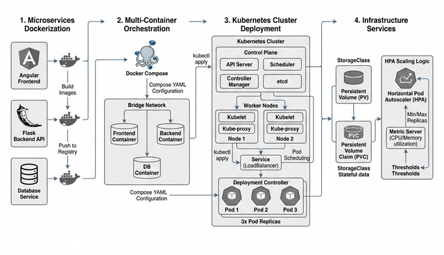

# SWAPI-PY Application Documentation

## Overview

SWAPI-PY is a Star Wars API inspired web application that provides comprehensive access to Star Wars universe data. Built with modern web technologies, it offers both a RESTful API backend and an interactive web interface for managing and exploring Star Wars films, characters, planets, species, starships, and vehicles.

## Purpose

The application serves as a comprehensive Star Wars database management system with the following core purposes:

1. **Data Management**: Centralized storage and management of Star Wars universe entities
2. **API Services**: RESTful API endpoints for programmatic access to Star Wars data
3. **Web Interface**: User-friendly Angular frontend for browsing and managing content
4. **Authentication**: Secure JWT-based user authentication and authorization
5. **Administration**: Admin panel for system monitoring and configuration

## Architecture

### Technology Stack

**Backend:**
- **Framework**: Python Flask 2.1.2
- **ORM**: SQLAlchemy 1.4.40 with Flask-SQLAlchemy
- **Authentication**: Flask-JWT-Extended 4.4.4
- **API Documentation**: Flask-RESTX 0.5.1 (Swagger/OpenAPI)
- **Serialization**: Marshmallow 3.18.0
- **Caching**: Flask-Caching 2.0.1
- **Database**: PostgreSQL (primary), SQLite (development)

**Frontend:**
- **Framework**: Angular 13.3.1
- **UI Library**: Bootstrap 5.1.3 with ng-bootstrap
- **Icons**: FontAwesome
- **Build Tool**: Webpack with Angular CLI

**Development Tools:**
- **Package Management**: Poetry (Python), npm (Node.js)
- **Testing**: PyTest (backend), Jest (frontend)
- **Code Quality**: Ruff, Black, ESLint
- **Security**: Bandit security scanner

### System Architecture

```
┌─────────────────┐    ┌─────────────────┐    ┌─────────────────┐
│   Angular SPA   │    │   Flask API     │    │   PostgreSQL    │
│   (Frontend)    │◄──►│   (Backend)     │◄──►│   (Database)    │
└─────────────────┘    └─────────────────┘    └─────────────────┘
         │                       │                       │
         │              ┌─────────────────┐              │
         │              │   JWT Auth      │              │
         │              │   + Caching     │              │
         │              └─────────────────┘              │
         │                                               │
    ┌─────────────────┐                          ┌─────────────────┐
    │   Admin Panel   │                          │   Swagger UI    │
    │   (Monitoring)  │                          │   (API Docs)    │
    └─────────────────┘                          └─────────────────┘
```

## Core Entities

### 1. Film
Represents Star Wars movies and media content.

**Attributes:**
- `title`: Movie title
- `episode_id`: Episode number in the saga
- `opening_crawl`: Introductory text
- `director`: Film director
- `producer`: Film producer
- `release_date`: Release date

**Relationships:**
- Many-to-many with Person (characters)
- Many-to-many with Planet (locations)
- Many-to-many with Species (alien races)
- Many-to-many with Starship (spacecraft)
- Many-to-many with Vehicle (ground vehicles)

### 2. Person
Represents characters in the Star Wars universe.

**Attributes:**
- `name`: Character name
- `height`, `mass`: Physical measurements
- `hair_color`, `skin_color`, `eye_color`: Physical appearance
- `birth_year`: When the character was born
- `gender`: Character gender

**Relationships:**
- Many-to-one with Planet (homeworld)
- Many-to-many with Species
- Many-to-many with Vehicle (vehicles piloted)
- Many-to-many with Starship (starships piloted)

### 3. Planet
Represents worlds in the Star Wars galaxy.

**Attributes:**
- `name`: Planet name
- `rotation_period`: Day length in hours
- `orbital_period`: Year length in days
- `diameter`: Planet size
- `climate`: Weather conditions
- `gravity`: Gravitational force
- `terrain`: Surface features
- `surface_water`: Percentage of water coverage
- `population`: Number of inhabitants

### 4. Species
Represents alien races and sentient beings.

**Attributes:**
- `name`: Species name
- `classification`: Biological classification
- `designation`: Sentience designation
- `average_height`: Typical height
- `skin_colors`, `hair_colors`, `eye_colors`: Physical variations
- `average_lifespan`: Life expectancy
- `languages`: Native languages

**Relationships:**
- Many-to-one with Planet (homeworld)

### 5. Starship
Represents spacecraft capable of interstellar travel.

**Attributes:**
- `name`: Starship name
- `model`: Ship model/class
- `manufacturer`: Shipbuilder
- `cost_in_credits`: Purchase price
- `length`: Ship dimensions
- `max_atmosphering_speed`: Top atmospheric speed
- `crew`: Required crew size
- `passengers`: Passenger capacity
- `cargo_capacity`: Cargo space
- `consumables`: Supply duration
- `hyperdrive_rating`: FTL capability
- `MGLT`: Megalight per hour rating
- `starship_class`: Ship classification

### 6. Vehicle
Represents ground and atmospheric vehicles.

**Attributes:**
- `name`: Vehicle name
- `model`: Vehicle model
- `manufacturer`: Vehicle manufacturer
- `cost_in_credits`: Purchase price
- `length`: Vehicle dimensions
- `max_atmosphering_speed`: Maximum speed
- `crew`: Required crew
- `passengers`: Passenger capacity
- `cargo_capacity`: Cargo space
- `consumables`: Supply duration
- `vehicle_class`: Vehicle type

## API Endpoints

### Authentication
- `POST /api/authenticate` - User login
- `POST /api/register` - User registration
- `POST /api/account/reset-password/init` - Password reset request
- `POST /api/account/reset-password/finish` - Complete password reset
- `GET /api/account` - Get current user info
- `POST /api/logout` - User logout

### Films
- `GET /api/films` - List all films (paginated)
- `GET /api/films/{id}` - Get specific film
- `PUT /api/films/{id}` - Update film (authenticated)
- `DELETE /api/films/{id}` - Delete film (authenticated)

### Characters (Persons)
- `GET /api/people` - List all characters
- `GET /api/people/{id}` - Get specific character
- `PUT /api/people/{id}` - Update character
- `DELETE /api/people/{id}` - Delete character

### Planets
- `GET /api/planets` - List all planets
- `GET /api/planets/{id}` - Get specific planet
- `PUT /api/planets/{id}` - Update planet
- `DELETE /api/planets/{id}` - Delete planet

### Species
- `GET /api/species` - List all species
- `GET /api/species/{id}` - Get specific species
- `PUT /api/species/{id}` - Update species
- `DELETE /api/species/{id}` - Delete species

### Starships
- `GET /api/starships` - List all starships
- `GET /api/starships/{id}` - Get specific starship
- `PUT /api/starships/{id}` - Update starship
- `DELETE /api/starships/{id}` - Delete starship

### Vehicles
- `GET /api/vehicles` - List all vehicles
- `GET /api/vehicles/{id}` - Get specific vehicle
- `PUT /api/vehicles/{id}` - Update vehicle
- `DELETE /api/vehicles/{id}` - Delete vehicle

### Administration
- `GET /api/management/health` - System health check
- `GET /api/management/info` - Application information
- `GET /api/management/metrics` - System metrics
- `GET /api/management/configprops` - Configuration properties

## Features

### Security
- JWT-based authentication with configurable expiration
- Role-based access control (RBAC)
- Password hashing with bcrypt
- CORS support for cross-origin requests
- Security headers and middleware

### Performance
- Database connection pooling
- Response caching with Flask-Caching
- Pagination for large datasets
- Lazy loading for database relationships
- Optimized database queries

### User Interface
- Responsive Angular SPA
- Bootstrap-based UI components
- Real-time data updates
- Pagination and filtering
- Admin dashboard with monitoring
- Interactive API documentation (Swagger UI)

### Development Features
- Hot reload for development
- Comprehensive test suites
- Code quality tools and linting
- Security vulnerability scanning
- Docker containerization support
- Database migrations with Liquibase

## Containerization and Deployment



### Docker Setup

The application is containerized using optimized multi-stage builds for both backend and frontend services.

#### Backend (Flask)
The backend uses `Dockerfile.backend` based on `python:3.10-slim`.
```bash
docker build -t swapi-backend -f Dockerfile.backend .
```

#### Frontend (Angular)
The frontend uses `Dockerfile.frontend` which builds the Angular app with Node 16 and serves it with Nginx.
```bash
docker build -t swapi-frontend -f Dockerfile.frontend .
```

### Docker Compose

For local development and orchestration of multiple services (Backend, Frontend, and Database), use Docker Compose.

**Services:**
- `db`: PostgreSQL 14 Database
- `backend`: Flask API Service
- `frontend`: Angular Web Interface

**Running the Stack:**
```bash
# Start all services in the background
docker-compose up -d

# View logs
docker-compose logs -f
```

**Configuration:**
The compose file handles networking, health checks, and service dependencies to ensure the backend starts only after the database is ready.

### Kubernetes Deployment

The application is prepared for deployment on a Kubernetes cluster with built-in scalability and persistent storage.

#### Prerequisites
- A running Kubernetes cluster (Minikube, EKS, GKE, etc.)
- `kubectl` configured to communicate with the cluster.

#### Deployment Steps
1. **Apply Manifests:**
   ```bash
   # Deploy storage first
   kubectl apply -f k8s/storage.yaml
   
   # Deploy database
   kubectl apply -f k8s/database.yaml
   
   # Deploy Backend & Frontend
   kubectl apply -f k8s/backend.yaml
   kubectl apply -f k8s/frontend.yaml
   ```

2. **Verify Deployment:**
   ```bash
   kubectl get pods
   kubectl get services
   ```

#### Persistent Storage
The database uses a `PersistentVolume` and `PersistentVolumeClaim` (defined in `k8s/storage.yaml`) to ensure data persists even if the pod is restarted or moved.

#### Scaling
Horizontal Pod Autoscaler (HPA) is configured for the backend service (defined in `k8s/hpa.yaml`).
- **Minimum Replicas:** 2
- **Maximum Replicas:** 5
- **CPU Target:** 70%

**Apply Scaling:**
```bash
kubectl apply -f k8s/hpa.yaml
```

**Verify Scaling:**
A verification script is provided in `scripts/verify_scaling.sh` to simulate load and monitor pod scaling.

### Environment Variables
- `DATABASE_URL`: PostgreSQL connection string
- `JWT_SECRET_KEY`: JWT signing key
- `FLASK_ENV`: Application environment (development/production)

## Monitoring and Maintenance

### Health Checks
- Database connectivity monitoring
- Memory and CPU usage tracking
- Response time metrics
- Error rate monitoring

### Logging
- Structured logging with timestamps
- Request/response logging
- Error tracking and reporting
- Performance metrics collection

### Testing
```bash
# Backend tests
poetry run pytest

# Frontend tests
npm test

# Code coverage
poetry run task coverage

# Security scan
poetry run task security_scan
```

## API Documentation

Interactive API documentation is available at:
- **Swagger UI**: `http://localhost:8080/api/v3/api-docs/default`
- **API Specification**: OpenAPI 3.0 compliant

## Support and Maintenance

The application follows modern development practices with:
- Automated testing and CI/CD ready
- Security best practices implementation
- Performance monitoring capabilities
- Scalable architecture design
- Comprehensive error handling
- Detailed logging and debugging support